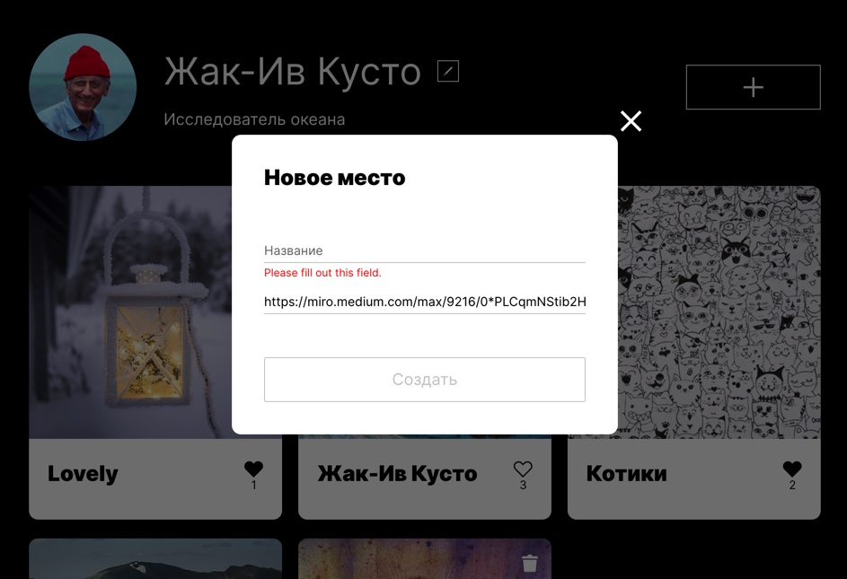

# Mesto
Учебный проект **Место** по профессии Веб-разработчик. Опубликованный проект подключен к **`серверу`** 
и можно посмотреть **[здесь](https://yuliaiv-iv.github.io/mesto)**

### Описание

Данный интерактивный сервис с элементами соц сети позволяет опубликовывать и удалять созданные карточки. Реализация постановки и снятие лайка, просмотр фотографий в увеличенном формате. **`Валидация форм`** через **`JavaScript`** в всплывающих pop ups. Возможность обновлять инфо и аватар юзера. Закрытие pop ups осуществляется на крестик, ESC и overlay

### Технологии

При разработке веб-сайта использованы следующие технологии:
  Nested файловая структура **`CSS по методологии БЭМ`**, **`ООП`**,
  **`адаптивная верстка`** с использованием **`медиа-запросов`**,
  **`flex`** или **`grid-layout`**, валидация форм, взаимодействие с **`API`**

### Figma 
**[Ссылка](https://www.figma.com/file/StZjf8HnoeLdiXS7dYrLAh/JavaScript.-Sprint-4)** на макет в Figma

